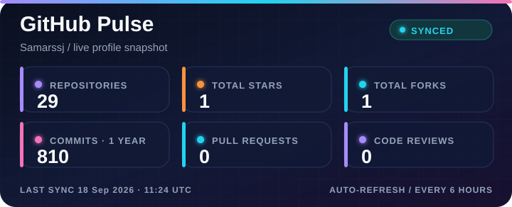
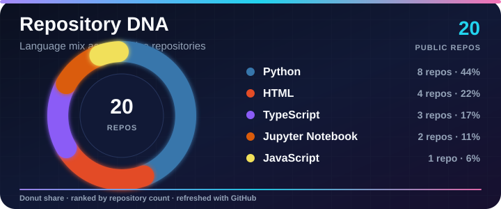
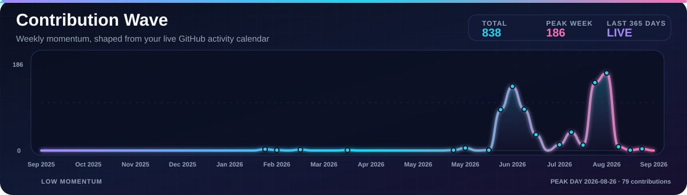

# Hi there, I'm Samar Singh 👋

### AI Developer · Machine Learning Enthusiast · Builder of Intelligent Systems

<table align="center" border="0">
  <tr>
    <td align="center">
      
    </td>
    <td align="center">
      
    </td>
    <td align="center">
      
    </td>
    <td align="center">
      
    </td>
  </tr>
</table>

---

## About Me

I am an **AI Developer and Machine Learning enthusiast** focused on building practical, intelligent systems. I enjoy working at the intersection of **psychology, natural language, cloud platforms, and software engineering**—exploring how human thinking can inspire better machine experiences.

At **EXL Services**, I work with technologies including **GCP, CX Agent Studio, Dialogflow CX, Vertex AI, Java, Node.js, MongoDB, Python, and machine learning**. I am continuously learning about automation, agentic AI, feature engineering, and predictive algorithms.

> *“The intersection of psychology and technology is where I believe the most exciting innovations happen.”*

## Current Focus

## Technology Stack

 

## What I Work On

| Area | Focus |
| --- | --- |
| **AI & ML** | Agentic AI, NLP, feature engineering, predictive algorithms, and automation |
| **Cloud Engineering** | GCP, Cloud Run, Vertex AI, Docker, Kubernetes, and webhooks |
| **Application Development** | Java, Python, JavaScript, Node.js, REST APIs, and FastAPI |
| **Data & Storage** | MongoDB, Firestore, SQLite, vector databases, Pandas, NumPy, and Matplotlib |

## GitHub Analytics

 

## Let's Connect

 

<a href="https://samar-portfolio1.vercel.app">Portfolio</a> ·
<a href="https://www.linkedin.com/in/samar-singh-3a4560289">LinkedIn</a> ·
<a href="https://github.com/Samarssj">GitHub</a>

 

**Always open to learning, collaborating, and building meaningful AI-powered solutions**

---

Designed with curiosity, code, and a little bit of machine learning.

